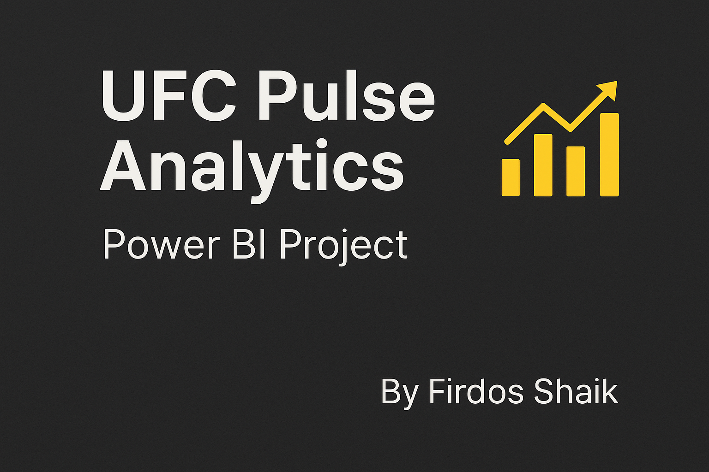

# 🥊 UFC Pulse Analytics – Power BI Project

## 📖 Project Overview
**UFC Pulse Analytics** is a comprehensive Power BI project designed to analyze UFC fight data, providing actionable insights on fighter performance, event trends, and fight outcomes.  
The project demonstrates end-to-end analytics — from data preparation and modeling to interactive visual storytelling.

---

## 🧰 Tools & Skills Used
- **Power BI** – Data visualization and dashboard creation  
- **DAX (Data Analysis Expressions)** – Calculations and KPIs  
- **Power Query** – ETL & data cleaning  
- **Data Modeling** – Relationships and measures optimization  

---

## 📊 Dashboards

### 1️⃣ Fighter Performance Overview Dashboard
**KPIs:**  
- Total Events | Total Fights | Total Fighters | Knockout (%) | Submission (%) | Win Rate (%)

**Visuals:**  
- Top Fighters by Wins  
- Fight Outcome by Weight Class  
- Most Common Win Methods  
- Fighter Stance Distribution  

---

### 2️⃣ Event Insights Dashboard
**KPIs:**  
- Total Events | Total Fights | Most Frequent Referee | Avg Fights per Event | Most Active Location

**Visuals:**  
- Fights Over Time  
- Fights per Event  
- Event Locations (Map)  
- Most Active Referees  

---

### 3️⃣ Fight Analytics Dashboard
**KPIs:**  
- Sig. Accuracy % | TD Accuracy % | Avg Control Time | Avg Sub Attempts | Avg Fight Time | Finish Rate %

**Visuals:**  
- Control Time Distribution  
- Striking vs Takedown Accuracy  
- Total Wins by Weight Class  
- Top Fighters by Wins  

---

## 🚀 Insights & Impact
- Identified top-performing fighters by win percentage.  
- Revealed correlations between striking and takedown accuracy.  
- Highlighted the most active event locations and referees.  
- Strengthened my proficiency in **Power BI, DAX, and data storytelling**.

---

## 🧩 Project Structure
UFC-Pulse-Analytics/
│
├── Dataset/ →  CSV files used in the analysis
├── Dashboards/ → Dashboard screenshots
├── UFC Pulse Analytics.pbix → Power BI file
└── README.md → Project documentation

---

## 📈 Next Steps
Continuing to enhance my **analytics and visualization skills** by exploring new datasets and building projects that bridge **data and decision-making**.

---

## 👤 Author
**Firdos Shaik**  
📍 Hyderabad, India  
📧 [fidduraza9876@gmail.com](mailto:fidduraza9876@gmail.com)  
🔗 [LinkedIn Profile](https://www.linkedin.com/in/firdos-shaik-551b4222b/)

---

### 🏷️ Tags
`Power BI` `Data Analytics` `Sports Analytics` `DAX` `Dashboard Design` `Data Visualization`
